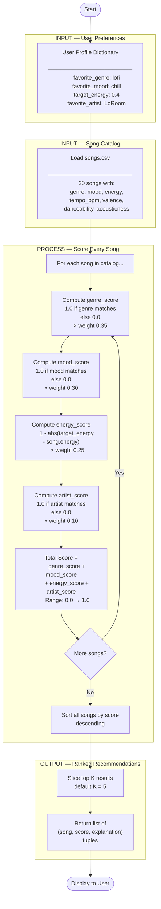

# Music Recommender — Data Flow Design

```mermaid
flowchart TD
    A([Start]) --> B

    subgraph INPUT ["INPUT — User Preferences"]
        B["User Profile Dictionary
        ─────────────────────
        favorite_genre: lofi
        favorite_mood: chill
        target_energy: 0.4
        favorite_artist: LoRoom"]
    end

    B --> C

    subgraph INPUT2 ["INPUT — Song Catalog"]
        C["Load songs.csv
        ─────────────────────
        20 songs with:
        genre, mood, energy,
        tempo_bpm, valence,
        danceability, acousticness"]
    end

    C --> D

    subgraph PROCESS ["PROCESS — Score Every Song"]
        D["For each song in catalog..."] --> E

        E["Compute genre_score
        1.0 if genre matches
        else 0.0
        × weight 0.35"]

        E --> F["Compute mood_score
        1.0 if mood matches
        else 0.0
        × weight 0.30"]

        F --> G["Compute energy_score
        1 - abs(target_energy - song.energy)
        × weight 0.25"]

        G --> H["Compute artist_score
        1.0 if artist matches
        else 0.0
        × weight 0.10"]

        H --> I["Total Score =
        genre_score + mood_score
        + energy_score + artist_score
        Range: 0.0 → 1.0"]

        I --> J{"More songs?"}
        J -- Yes --> E
        J -- No --> K
    end

    subgraph OUTPUT ["OUTPUT — Ranked Recommendations"]
        K["Sort all songs by score
        descending"] --> L

        L["Slice top K results
        default K = 5"] --> M

        M["Return list of
        (song, score, explanation)
        tuples"]
    end

    M --> N([Display to User])
```
